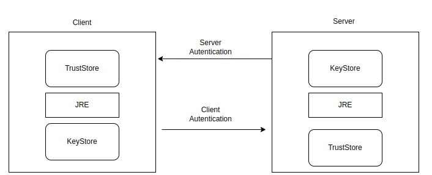

## Conceitos - Certificados

- Certificado Digital -Arquivos compostos por um par de chaves (Chave Pública e Privativa) e a assinatura de uma terceira parte confiável, Autoridade Certificadora(AC).

- Java Keytool – é uma ferramenta de gerenciamento de certificados e chaves;

- Java Keystore(JKS) -É um repositório chaves e certificados criados por essas chaves, e cada entrada(certificado + chaves) pode ser identificado por um Alias. O próprio arquivo utilizado como Keystore pode ser protegido com senha. Ao acessar um Keystore sem informar a senha apenas os certificados podem ser acessados. Cada chave privada pode possuir sua própria senha, ou seja, para usar uma Chave Privada que está em um Keystore temos que informar duas senhas, uma da Keystore e outra, da Chave Privada;

- TrustStore – Área de armazenamento de chaves confiáveis. Geralmente contém certificados confiáveis ou apenas certificados das autoridades certificadoras.

## TLS/SSL

- Os protocolos TLS (Transport Layer Security) e SSL (Secure Socket Layer) são frequentemente usados para se referir à mesma coisa: comunicação HTTPS. Ambos visam a segurança, integridade e privacidade durante a comunicação cliente-servidor.

- A espinha dorsal do TLS é uma infraestrutura de chaves públicas que viabiliza a confiança mútua entre duas partes (cliente e servidor) que nunca trabalharam juntas. Isso tudo é realizado por um sistema de Certificate Authorities (CAs) que assinam certificados que passam a servir de credenciais para servidores, atestando sua identidade. Assim, quando um cliente tenta se conectar a esse servidor via HTTPS (TLS), esse servidor apresenta seu certificado ao cliente. Se a autoridade que assinou o certficado desse servidor estiver na lista de autoridades confiáveis do cliente, então um canal de comunicação segura é estabelecido entre esse cliente e o respectivo servidor.

- Quando o cliente é uma aplicação java, a lista de autoridades confiáveis é chamada de truststore. Do lado do servidor [quando ele também é uma aplicação java], seu certificado (e as respectivas chaves) fica armazenado em uma keystore.

- Geralmente, quando você é um servidor, trabalha mais com o keystore; quando você é cliente, está mais interessado no seu truststore.

- O Truststore na prática é um conjunto de certificados armazenados no JDK que a aplicação utiliza para determinar se confia ou não no servidor TLS que ela está acessando. Todo JDK vem com uma lista de CAs pré-definidos no Truststore.

- O keytool é um programa em linha de comando que permite trabalhar com truststores e keystores. Como dissemos, você trabalha mais com o keystore se for um server; ou trabalha mais com o truststore, se for um cliente.

- Exemplos:

  - O seguinte comando lista todas as autoridades pré-aceitas no JDK (o password default é changeit para rodar o comando):

  ```
  keytool -list -keystore $JAVA_HOME/jre/lib/security/cacerts
  ```

  - se a aplicação cliente não confia no web service, podemos baixar o certificado pelo browser (arquivo tipo CRT) e importá-lo:

  ```
  keytool -import -alias "docamazon" -keystore java_home/jre/lib/security/cacerts -file arq_baixado.crt
  ps. senha default cacerts = changeit
  ```

  - para remover um certificado:

  ```
  keytool -delete -alias "docamazon" -keystore java_home/jre/lib/security/cacerts
  ```

  - para verificar se o JDK confia em um certificado:

  ```
  keytool -list -keystore $JAVA_HOME/jre/lib/security/cacerts | grep ' fingerprint '
  ```

  - onde está fingerprint substitua pelo fingerprinto do certificado (consulte no browser clicando no cadeado de algum site)
  - Como esse CA consta no truststore do JDK, podemos acessar essa url via código sem problemas:
    ```
    String hostURL = "https://docs.aws.amazon.com";
    URL url = new URL(hostURL);
    HttpsURLConnection conn;
    conn = (HttpsURLConnection)url.openConnection();
    InputStream is = conn.getInputStream();
    ```

- Podemos criar uma nova TrustStore e adicionar um certificado para uma url que não é reconhecida pela truststore default do JDK. O código abaixo cria uma nova TrsutStore e adiciona nela o certificado de https://self-signed.badssl.com, fazendo com que a aplicação consiga acessar a URL via HTTPS sem erros:

```
public class AdicionaCertificado {

    public static void main(String args[]) throws Exception {

        String hostURL = "https://self-signed.badssl.com";
        //String hostURL = "https://docs.aws.amazon.com";
        loadNewCertificate("/home/rafael/Library/Blog/Certs/badssl-com.pem");

        URL url = new URL(hostURL);
        HttpsURLConnection conn;
        conn = (HttpsURLConnection)url.openConnection();
        InputStream is = conn.getInputStream();
    }

    static void loadNewCertificate(String newCertficateFile) throws KeyStoreException, CertificateException, NoSuchAlgorithmException, IOException {

        String trustStorePass = "123456";
        String clientTrutStorePath = "/home/rafael/Library/Blog/Certs/myNewTrustStore";
        String alias = "badssl.com";

        // criando uma nova trustStore (diferente da default cacerts)
        KeyStore clientTrustStore = KeyStore.getInstance(KeyStore.getDefaultType());

        char[] password = trustStorePass.toCharArray();

        // para criar uma nova truststore vazia, passe null no 1o argumento...
        clientTrustStore.load(null, password);

        // ...e crie o arquivo fisico vazio
        FileOutputStream fos = new FileOutputStream(clientTrutStorePath);
        clientTrustStore.store(fos, password);
        fos.close();

        // como a keystore já existe, desta vez não passamos null ao metodo load
        FileInputStream in = new FileInputStream(clientTrutStorePath);
        clientTrustStore.load(in, password);
        in.close();

        // CertficateFactory é usada para gerar novos certificados
        CertificateFactory cf = CertificateFactory.getInstance("X.509");
        InputStream serverCertstream = new FileInputStream(newCertficateFile);

        // gera um objeto certificado e o inicializa com base nos dados do InputStream
        Certificate serverCertificate =  cf.generateCertificate(serverCertstream);

        // adiciona o novo certificado a nova keystore, com um apelido
        clientTrustStore.setCertificateEntry(alias, serverCertificate);

        // salvamos as alteracoes na nova keystore
        FileOutputStream out = new FileOutputStream(clientTrutStorePath);
        clientTrustStore.store(out, password);
        out.close();

        // dinamicamente alteramos o trsutstore default desta App para a nova trsutStore criada
        System.setProperty("javax.net.ssl.trustStore", clientTrutStorePath);
        System.setProperty("javax.net.ssl.trustStorePassword", trustStorePass);
    }
}
```

- Podemos criar nosso próprio certificado para posteriormente apresentá-lo aos clientes de sua aplicação. O comando a seguir cria uma chave privada e um certificado contendo a chave pública:

```
keytool -genkeypair -alias meu-alias -keyalg RSA -validity 7 -keystore minha-keystore
```

- O próximo comando extrai o certificado do arquivo minha-keystore com a extensão .cer:

```
keytool -exportcert -alias meu-alias -keystore minha-keystore -rfc -file meu-certificado.cer

```

- <b>Nota</b>: um detalhe para se estar ciente e que pode causar confusão é que, da perspectiva do keytool e do Java, keystores e truststores são arquivos keystore. Eles apenas contêm diferentes tipos de chaves. Tanto que a referência a clientTrustore no código foi representada pela classe java.security.KeyStore.

## TrustStore e KeyStore

TrustStore

- usado para armazenar certificados de Autoridades Certificadas (CA) que verificam o certificado apresentado pelo servidor em uma conexaão SSL.
- pode ser chamada de um repositório de chaves públicas

KeyStore

- armazena a chave privada e os certificados de identidade que um programa especifíco deve apresentar a ambas as partes para verificação.

São os opostos um do outro. TrustStore armazena os certificados de terceiros, de serviços que utilizo. O keystore armazena os certificados que nos identificam.



## Formatos de Certificados

- Diferentes plataformas e dispositivos exigem que os Certificados sejam convertidos para formatos diferentes. Um servidor Windows exporta e importa arquivos .pfx, um servidor Apache usa arquivos PEM (.crt, .cer) individuais.

<b>Formato PEM</b>

- Os certificados PEM geralmente têm extensões como .pem, .crt, .cer e .key . Eles são arquivos ASCII codificados em Base64 e contêm instruções "----- BEGIN CERTIFICATE -----" e "----- END CERTIFICATE -----". Certificados de servidor, certificados intermediários e chaves privadas podem ser colocados no formato PEM.

<b>Formato DER</b>

- O formato DER é a forma binária de um certificado em vez do formato ASCII PEM. Às vezes, ele tem uma extensão de arquivo .der, mas geralmente tem uma extensão de arquivo .cer, portanto, a única maneira de diferenciar um arquivo DER .cer de um arquivo PEM .cer é abri-lo em um editor de texto e procurar as instruções BEGIN / END. Todos os tipos de certificados e chaves privadas podem ser codificados no formato DER. O DER é normalmente usado com plataformas Java.

<b>Formato PKCS #7 / P7B</b>

- O formato PKCS # 7 ou P7B é armazenado no formato Base64 ASCII e possui uma extensão de arquivo de .p7b ou .p7c . Os certificados P7B contêm instruções "----- BEGIN PKCS7 -----" e "----- END PKCS7 -----". Um arquivo P7B contém apenas certificados e certificados de cadeia, não a chave privada.

<b>Formato PKCS #12 / PFX </b>

- O formato PKCS # 12 ou PFX é um formato binário para armazenar o certificado do servidor, quaisquer certificados intermediários e a chave privada em um arquivo criptografável. Os arquivos PFX geralmente possuem extensões como .pfx e .p12 . Os arquivos PFX são normalmente usados ​​em máquinas Windows para importar e exportar certificados e chaves privadas.

  - Ao converter um arquivo PFX para o formato PEM, o OpenSSL colocará todos os certificados e a chave privada em um único arquivo. Você precisará abrir o arquivo em um editor de texto e copiar cada certificado e chave privada (incluindo as instruções BEGIN / END) em seu próprio arquivo de texto individual e salvá-los como certificate.cer, CACert.cer e privateKey.key, respectivamente.

## Converter Formatos Certificados

- Para converter certificados de um tipo para outro podemos usar o OpenSSL.

- Use os seguintes comandos OpenSSL para converter o certificado em diferentes formatos em sua própria máquina:

  - Converter PEM para DER

    - openssl x509 -outform der -in certificate.pem -out certificate.der

  - Converta PEM para P7B

    - openssl crl2pkcs7 -nocrl -certfile certificate.cer -out certificate.p7b -certfile CACert.cer

  - Converter PEM para PFX

    - openssl pkcs12 -export -out certificate.pfx -inkey privateKey.key -in certificate.crt -certfile CACert.crt

  - Converter DER para PEM

    - openssl x509 -inform der -in certificate.cer -out certificate.pem

  - Converter P7B para PEM

    - openssl pkcs7 -print_certs -in certificate.p7b -out certificate.cer

  - Converter P7B para PFX

    - openssl pkcs7 -print_certs -in certificate.p7b -out certificate.cer
    - openssl pkcs12 -export -in certificate.cer -inkey privateKey.key -out certificate.pfx -certfile CACert.cer

  - Converter PFX para PEM
    - openssl pkcs12 -in certificate.pfx -out certificate.cer -nodes

### Referências

https://acervolima.com/diferenca-entre-truststore-e-keystore-em-java/
https://sistemaaula.com.br/crm/knowledge-base/article/formatos-de-certificado-e-conversor-online-e-openssl
https://finalexception.blogspot.com/2020/04/seguranca-com-java-certificados.html
