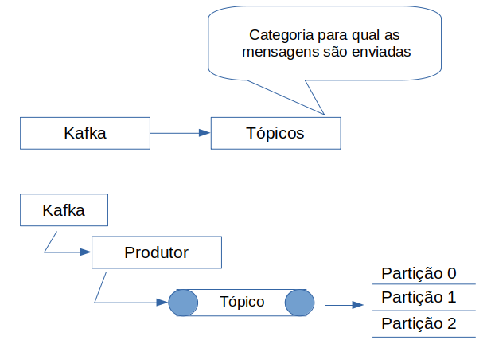
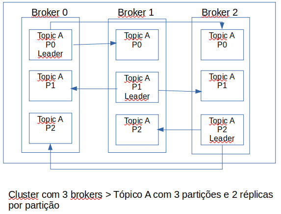

# Notas curso Red Hat - Kafka AMQ Streams

- aplicativos reativos > arquitetura orientada a eventos
- aplicativos orientados a eventos: síncronos ou assíncronos (reativos, acoplamento fraco, E/S assíncrono e sem bloqueio)

Arqitetura Orientada a eventos

- publisher / subscriber
- transmissão de eventos, pipelines de transmissão (grandes quantidades de dados em tempo real)
- arquitetura reativa: responsividade > resiliência > orientado a evento > elasticidade

- Red Hat AMQ Streams

- plataforma de transmissão de dados escalável, distribuída e de alto desempenho baseado no kafka.
- tolerância a falhas
- responde a eventos em tempo real
- captura fluxo de dados de eventos ou alteração de dados
- agregação de registros - abstrai detalhes dos arquivos e os transforma em fluxo de dados
- Partição: coleção ordenada de mensagens dentro do tópico - a ordem é garantida dentro da partição mas não dentro do tópico.

- Cada tópico dividido em partições. Uma partição é uma coleção ordenada de mensagens dentro de um tópico.
- As partições são divididas entre os brokers do cluster. Assim a carga de trabalho é distribuída pelos brokers e que o tópico seja dimensionado horizontalmente.
- Cada partição é replicada para fornecer redundância de dados em casos de falha - são distribuídas entre os brokers do kafka no cluster. Entre as réplicas localizadas nos diferentes brokers o kafka seleciona um leader.
- Produtores e Consumidores somente gravam e lêem os dados da partição líder e em seguida os dados são propagados para as réplicas - se o o broker da partição líder falhar (ficar inativo) o kafka seleciona outro líder entre as réplicas garantindo a disponibilidade.
- Cada líder de partição é um broker diferente, o que garante que os consumidores leiam os eventos em máqinas diferentes.

## Métodos de envio de dados

## Comandos Básicos

## Bibliografia

- Kafka: The Definitive Guide - O'Reily
