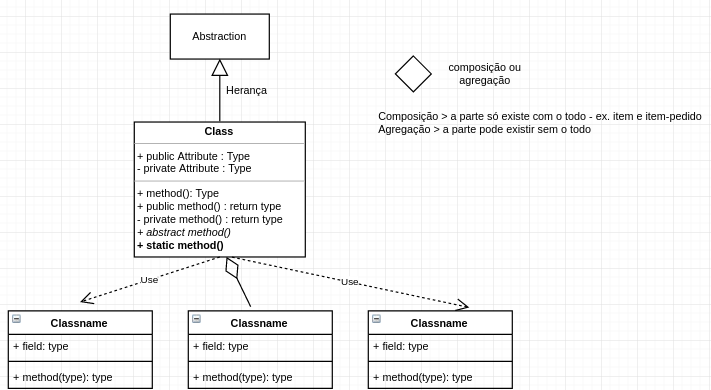
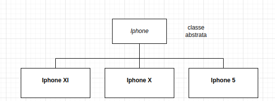

# Padrões de Projeto



## Padrões Criacionais

### Factory Method

- Como deixar o código desacoplado das classes concretas?
- O método Factory Method decide qual implementação retornar de uma instância baseado em alguma regra.
  
- A classe factory deve conseguir criar a instância de cada um dos tipos de iphone de acordo com os valores informados.

```
  abstract class IphoneFactory {
    public Iphone orderIphone(){
        Iphone iphone = null;
        iphone = createIphone();
        iphone.getHardware();
        iphone.getAssemble();
        iphone.getCertificate();
        iphone.getPack();
        return iphone;
    }
    protected abstract Iphone createIphone();
    ...
  }
```

Variações
1 - o método abstrato createIphone() sem argumento sugere que devemos ter uma classe concreta para cada tipo de Iphone.
2 - pode-se passar um argumento para o método orderIphone() para que ele possa decidir qual instância criar. Assim esse método deve ser static e o método abstrato não seria mais necessário.

### Abstract Factory

- Como escrever um código onde as classes instanciadas possam variar dentro da mesma interface?
- Como garantir que um conjunto de objetos relacionados possam ser criados mantendo um contexto único (cenário de aplicação)?

- Extraindo a lógica de criação dos objetos para um abstract factory.
- Criando uma implementação do abstract factory para cada contexto, garantindo que todos os objetos estão relacionados.

Para ilustrar, tomemos o exemplo acima do Iphone. Consideremos que as operações de certificação e empacotamento variam de pais para pais. Podemos decompor em interfaces as operações e depois criar uma interface génerica que engloba as outras interfaces (operações).

```
  Interface Packing;
  Interface Certificado;

  Interface CountryRules {
    Interface packing;
    Interface Certificado;
  }
```

Com base no modelo acima passo a ter implementações concretas para cada interface.

Atentar para quando tiver operações que podem variar em função de alguma variável, se não essas operações não seriam candidatas a serem extraídas para interface.

### Padrão Singleton

- Como garantir que uma classe tenha uma única instância?

- Escondendo o construtor da classe com modificador private, e definindo um ponto de criação único, estático, que retorna uma única instância.

- Ressalva: a necessidade de ter um método estático inviabiliza o uso de interface. Como contorno temos o padrão monostate:
  - atributo private, mas static - inicializado em um bloco static;
  - assim a classe pode ter um construtor público;
    Desta forma você pode ter N instâncias compartilhando a variável static.

### Padrão Builder
