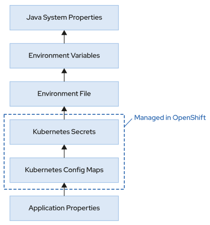

# Notas Quarkus - Redhat

## Arquitetura Microserviços

- Método de divisão de domínios da lógica de negócios em processos independentes, que se comunicam com outros processos pela rede. Cada serviço gira em torno de um domínio de negócio específico.
- Microserviços gerenciados independente, implantados usando automação.
- adequados para ambiente cloud
- dimensionados mais facilmente

Desafios:

- rastreamento (trace)
- monitoramento (N servidores) - arquivos de log's em vários locais
- proteger os aplicativos

Nota:

- microserviços deve ser uma unidade de implantação autocontida que pode ser implantada e usada com independência de outros serviços.
- os microserviços não tem estado.
- são empacotados e fornecidos por containers

Design para Falhas

- devem ser projetados para se recuperarem. Lidam com falhas e a experiência do usuário final não é afetada por uma única falha no serviço.

  - alta disponibilidade
  - usar padrão disjuntor para não propagar a falha
  - usar padrão bulkhead para evitar a sobrecarga de um serviço individual e para isolar falhas de propagação em todo o sistema, limitando o acesso simultâneo a serviços dependentes.
  - monitoramente em tempo real

  Padrão Disjuntor

  - Os microserviços devem lidar normalmente com falhas de downstream de serviços aos quais ele depende.
  - O objeto disjuntor envolve as chamadas de função para os serviços dependentes e monitora o sucesso das chamadas.

  - Quando tudo está normal, chamadas bem sucedidas, o disjuntor estará no estado fechado. Quando o número de falhas (uma exceção, tempo limite) atinge um valor pré-determinado o disjuntor falha - quando o disjuntor está aberto, nenhuma chamada é feita para o serviço dependente, mas uma resposta de fallback é retornada. Após um período de tempo configurável, o disjuntor passa para semiaberto. Nesse estado, o disjuntor executa as chamadas de serviço periodicamente para verificar a integridade do serviço dependente. Se o serviço estiver integro novamente, e as chamadas de teste forem bem sucedidas, o estado do circuito volta a ser fechado.

  Padrão Bulkhead

  - Isolar as dependências umas das outras e limitar o número de threads simultâneas que tentam acessar cada uma delas. Esse isolamento significa que essa chamada está impedida de usar mais do que essas threads.
  - Quando um aplicativo faz uma solicitação de conexão com um componente atrás do bulkhead, este verifica a disponibilidade de conexão com o componente solicitado, se o número de conexão estiver abaixo do limite, o bulkhead aloca a conexão, quando não são permitidas mais conexões simultâneas, o bulkead aguarda um intervalo de tempo definido, se nenhuma conexão ficar disponível dentro do período, o bulkhead rejeita a chamada.
  - Exs implementações: microprofile fault tolerance, hystrix, mesh, camel EIP, Disjuntor Apache Commons

## Implementações Tolerância a Falhas

- Quando um serviço depende de outro aplicativo, use uma estrutura de tolerância a falhas confiável para garantir que o microsserviço não sucumba a nenhuma falha de downstream.
- A implementação da política de tolerância a falhas no Quarkus usa <b>SmallRye Fault Tolerance</b>. SmallRye FaultTolerance é uma implementação da especificação MicroProfile Fault Tolerance.
- Essa especificação usa várias estratégias para minimizar os efeitos de falhas de dependência, implementando um conjunto de procedimentos de recuperação para microsserviços. Os procedimentos de recuperação definidos pela especificação de tolerância a falhas incluem o seguinte:
  - <b>Disjuntor (@org.eclipse.microprofile.faulttolerance.CircuitBreaker)</b> Compatível com uma abordagem fail fast se o sistema estiver sofrendo de uma sobrecarga ou estiver indisponível.
  - <b>Bulkhead (@org.eclipse.microprofile.faulttolerance.Bulkhead)</b> Limita a carga de trabalho de um microsserviço para evitar falhas causadas por simultaneidade ou sobrecarga de serviço.
  - <b>Fallback(@org.eclipse.microprofile.faulttolerance.Fallback)</b> Executa um método alternativo se a execução falhar para o método anotado.
  - <b>Repita a política (@org.eclipse.microprofile.faulttolerance.Retry)</b> Define as condições para uma repetição de execução com falha.
  - <b>Tempo-limite (@org.eclipse.microprofile.faulttolerance.Timeout)</b> Define o tempo máximo de execução antes de interromper uma solicitação.

### Casos de Uso

- Tempo Limite - Timeout

  A anotação <b>org.eclipse.microprofile.faulttolerance.Timeout</b> aplica-se a um método de ponto de extremidade e limita a quantidade de tempo que o método leva para gerar uma resposta. Se nenhuma resposta estiver disponível dentro do período, a estrutura interrompe a invocação do método de ponto de extremidade, gerando uma exceção TimeoutException.
  A anotação Timeout aceita dois parâmetros: value indica a quantidade de tempo e unit define a unidade de tempo usada. - O exemplo a seguir instrui a estrutura a interromper o método getProduct se ele não responder em menos de 200 segundos:

```
  @Timeout(value=200,unit = ChronoUnit.SECONDS )
  public Product getProduct(int id) {
  ...output omitted...
```

- Repeat

  A política Retry instrui a estrutura a repetir uma solicitação para um serviço se ela gerar uma exceção. Para ativar a política Retry em um método de ponto de extremidade, anote esse método com <b> org.eclipse.microprofile.faulttolerance.Retry </b> e forneça essa anotação com as opções apropriadas. Essas opções incluem o número máximo de repetições ou uma lista de situações que podem causar a repetição.
  O exemplo a seguir repete o método getProduct até 90 vezes, por no máximo 100 segundos, e somente enquanto o método gera exceções ou descendentes RuntimeException.

  ```
  @Retry(maxRetries=90, maxDuration=100, retryOn=RuntimeException.class})
  public Product getProduct(int id) {
    ...output omitted...
  }
  ```

- Fallback

  Os serviços ainda podem falhar mesmo ao usar um tempo-limite ou repetir solicitações. Nesses casos, se o retorno de uma resposta significativa for obrigatório, o serviço deverá criar uma resposta mais simples ou predefinida.O padrão Fallback permite que o desenvolvedor defina um método alternativo que a estrutura pode usar se o método do ponto de extremidade original não responder. O Quarkus usa a anotação org.eclipse.microprofile.faulttolerance.Fallback para definir esse método ou classe alternativo. Se a anotação de Fallback definir um método, esse método deve ter exatamente a mesma assinatura que o método original e deve ser acessível a partir da classe original.

  ```
  @Fallback(fallbackMethod="getCachedProduct")
  public Product getProduct(int id) {
    ...output omitted...
  }
  ...output omitted...
  public Product getCachedProduct(int id) {
    ...output omitted...
  }
  ```

  Se a anotação Fallback definir uma classe, essa classe deverá implementar um método da forma String handle(ExecutionContext context). Esse método deve ser acessível a partir da classe original.

- Circuit Break

  O padrão Circuit Breaker evita solicitações para um serviço temporário com falha ou degradado, explorando a afinidade temporal de alguns problemas. Ele explora a alta probabilidade de que uma falha de solicitação indica que as solicitações a seguir também falharão. A detecção rápida e segura de um serviço com falha é o tópico mais complexo da política Circuit Breaker.
  Para detectar um serviço com falha, o padrão Circuit Breaker usa uma janela de solicitação, que é um conjunto de solicitações consecutivas. Se o número de solicitações com falha dentro dessa janela estiver abaixo de um limite, a estrutura considera o serviço com defeito e abre o circuito.

  ```
  @org.eclipse.microprofile.faulttolerance.CircuitBreaker(requestVolumeThreshold = 4,
   failureRatio = 0.5, delay = 1000)
  public List<String> getProducts() {
    ...output omitted...
  }
  ```

  No código anterior, o circuito é aberto se metade das solicitações (failureRatio = 0.5) de quatro invocações consecutivas (requestVolumeThreshold=4) falharem. O circuito permanece aberto por 1.000 milissegundos e depois fica half-open. Após uma invocação bem-sucedida, o circuito é fechado novamente.

- Bulkhead

  Impedimento de saturação do serviço com o padrão Bulkhead. O padrão Bulkhead impede que um serviço funcione incorretamente devido à saturação. É comum encontrar serviços que se tornam não confiáveis ao receber muitas solicitações simultâneas. O padrão Bulkhead limita o número de solicitações simultâneas e faz com que solicitações além desse número sofram falha. Para habilitar o padrão Bulkhead, adicione a anotação <b>org.eclipse.microprofile.faulttolerance.Bulkhead</b> ao método de ponto de extremidade. Em seguida, indique o número máximo de solicitações simultâneas permitidas e o tamanho da fila de espera.

  ```
  @Bulkhead(value = 5, waitingTaskQueue = 8)
  public List getProducts() {
  ...output omitted...
  ```

  No exemplo anterior, as estruturas permitem apenas cinco invocações simultâneas do método getProducts(). Se você chamar o método com mais chamadas simultâneas, o bulkhead enfileira até oito solicitações pendentes. Depois que a fila é preenchida, solicitações adicionais acionam a implementação de tolerância a falhas para gerar uma exceção BulkheadException.

As políticas são aplicadas na seguinte ordem:

1. Se o circuito estiver aberto, a política Circuit Breaker gerará uma exceção.
2. Se o Bulkhead e sua fila estiverem cheios, ele gerará uma exceção.
3. Se nenhuma das etapas anteriores gerar uma exceção, a estrutura chamará o método de
   ponto de extremidade original.
4. A política Timeout interrompe a solicitação se ela demorar muito.
5. A política Retry repete a solicitação.
6. O método Fallback retorna a resposta de atalho se algum dos passos anteriores gerar uma
   exceção.

> O MicroProfile Fault Tolerance integra-se perfeitamente às especificações MicroProfile Configuration e MicroProfile Metrics.Por exemplo, a anotação Fallback gera uma métrica ft.<name>.fallback.calls.total, em que <name> é o FQN do método original. Essa métrica conta o número de vezes que o método de fallback responde. Para obter a lista completa de métricas e seus significados, consulte a especificação MicroProfile Fault Tolerance.

### Microprofile Health: Readiness e Liveness

A especificação MicroProfile Health permite que os serviços notifiquem o mecanismo de
orquestração do ciclo de vida de seu status atual, o que permite que o sistema aja de acordo. Isso
é feito usando dois pontos de extremidade dedicados: /q/health/ready e /q/health/live.

A verificação de integridade liveness verifica se os serviços estão em um status íntegro: o aplicativo não encontrou um erro irrecuperável. Exemplos disso podem ser um erro de memória ou um deadlock no código.

A verificação de integridade de readiness informa quando os serviços estão prontos para atender a solicitações. Essa verificação deve levar em consideração qualquer serviço externo necessário para a funcionalidade adequada do serviço. Exemplos dessa verificação incluem aguardar que um banco de dados ou serviços externos se tornem disponíveis.

## Microprofile

- Especificação Microprofile define um plataforma que otimiza o java para uma arquitetura baseada em microserviços e fornece portabilidade em vários tempos de execução.

- Microprofile não é uma especificação completa como o JSR. Versão inicial: JAX-RS, CDI, JSON-P.

## Quarkus

- Estrutura nativa em nuvem > plataforma de implantação > container
- Inicialização rápida
- Pegada de memória pequena
- Menor uso em disco
- Programação imperativa e reativa
- Suporte compilação antes do tempo AOT - ahead-of-time do GraalVM (JVM especial)
  - JVM precisa saber no momento da compilação quais classes serão usadas, para ofertar suporte executáveis nativos.
  - durante a compilação o GraalVM remove todas as classes desnecessárias, bibliotecas dependentes e da JVM.

### Implementação Microserviços

- Beans é qualquer objeto gerenciado pelo CDI - um bean especifica o tipo e a semântica dos outros beans dos quais depende.
- Ex de anotações que definem um bean: @ApplicationScoped, @SessionScoped, @ RequestScoped

### DI no Quarkus

- implementa apenas um subconjunto de especificação CDI
- ignora descritores no arquivo beans.xml
- implementado pelo Quarkus.Arc

### Revisões da Especificação

- JAX-RS - criação serviços web padrão rest, uso de anotação no nível de classe ou método
- JSON-b - manipular json - camada de ligação da estrutura do json para objetos java
- Para essa ligação funcionar as classes "pojo" devem ter:
  - construtores pojo sem parâmetros ou
  - anotar o construtor com @JsonbCreator e os nomes de parâmetros devem corresponder aos nomes das propriedades.
  - os atributos devem ser públicos
  - existir métodos get/set para cada atributo
    > quando não quiser deserializar um atributo > @JsonbTransient

> se quiser ignorar a propriedade para serialização use o @JsonbTransient no método get

### Persistência no Quarkus

- Dependências necessárias para persistência:
  - quarkus-hibernate-orm
  - quarkus-hibernate-orm-panache
  - driver do BD: h2 / postgres ... etc
- Todas as configurações em um único arquivo: application.properties - ex:
  - quarkus.datasource.db-kind=
  - quarkus.datasource.username=
  - quarkus.datasource.password=
  - quarkus.datasource.jdbc.url=
  - quarkus.hibernate-orm.database.generation=drop-and-create

#### Implementações

- EntityManager = tem que injetá-lo
- Panache com Repository - objetivo separar a lógica de recuperação de dados e seu mapeamento para entidades.

  - deve-se criar um repositório que extende de PanacheRepository para a entidade e injetá-lo onde for preciso - ex:

  ```
  @ApplicationScoped
  public class ExpenseRepository implements PanacheRepository<Expense { ... }
  ```

- Panache com Active Record - define os métodos que acessam a entidade na própria classe da entidade
- basta extender PanacheEntity
  - os atributos da entidade devem ser públicos
  - os atributos devem ser acessados com métodos get/set
  - possível criar métodos estáticos personalizados que executam consultas especifícas

> pasta: src/main/resources = pode-se criar o arquivo import.sql com instruções sql para popular ou criar o banco de dados

\*\* ex pag 57 e 68

## ConfigSource

O Quarkus usa a especificação MicroProfile Config para ajudar você a evitar o uso de valores codificados. Isto permite a configuração dinâmica de aplicativos, sem fazer alterações no próprio aplicativo. Isso facilita a execução do aplicativo em vários ambientes, o que pode incluir desenvolvimento, teste e produção.

Para facilitar a criação de arquivos de configuração, o MicroProfile usa o conceito de um ConfigSource.

Um ConfigSource é uma fonte para valores configurados, que podem vir de:
System Properties, Environment Variables ou um arquivo de configuração. Cada aplicativo pode ter várias fontes de configuração, que podem coexistir ao mesmo tempo, tendo diferentes prioridades.

Depois que os valores de configuração forem definidos, a segunda parte do uso da configuração é injetá-la em seu código. Isso é feito usando a anotação <b>@ConfigProperty</b>.

No Quarkus, você também pode usar a anotação @ConfigProperties como alternativa, que é menos detalhada.

Ex. application.properties

```
format=One format for %s unit.
unit=meter
debug-flag=true # We can omit this value.
```

Para ler as configurações acima:

```
...
@Path("/example")
public class ExampleResource {
  @ConfigProperty(name = "format")
  public String format;

  @ConfigProperty(name = "debug-flag", defaultValue="false")
  public boolean debugFlag;

  @ConfigProperty(name = "unit")
  public Optional<String> unit;
```

### Usando @ConfigProperties

O exemplo acima pode ser refatorado para usar a anotação <b>@ConfigProperties</b>.
Primeiro, você deve adicionar um prefixo example aos nomes de seus valores de configuração em application.properties, assim:

```
example.format=One format for %s unit.
example.unit=meter
example.debug-flag=true
```

Para ler as configurações:

```
@ConfigProperties(prefix = "example")
public class ExampleConfiguration {
    private String format;
    private boolean debugFlag = false;
    private Optional<String> unit
```

> a variável debug-flag terá seu hífen traduzido para definir a letra a seguir em maiúscula, mapeando-a para debugFlag

Um estilo alternativo ainda mais curto é criar uma interface em vez de uma classe.

```
@ConfigProperties(prefix = "example")
public interface ExampleConfiguration {
    String getFormat();

    @ConfigProperty(defaultValue = "false")
    boolean getDebugFlag();

    Optional<String> getUnit();
}
```

> Você ainda precisa da anotação @ConfigProperty para getDebugFlag() para definir um defaultValue, mas os outros dois getters serão injetados automaticamente. Essa interface se comportará exatamente da mesma forma que a classe acima.

```
@Path("/example")
public class ExampleResource {

    @Inject
    ExampleConfiguration config;

    @GET
    @Produces(MediaType.TEXT_PLAIN)
    public String getEndpoint() {
      if (config.getDebugFlag()) {
        System.out.println("The format is: " + config.getFormat());
        System.out.println("The unit is: " + config.getUnit().orElse("Not
          specified"));
    }
}
```

## Perfis de Configuração

Por padrão, você tem os seguintes perfis de configuração padrão disponíveis:

- dev > Ativado ao executar o aplicativo no modo de desenvolvimento.
- test > Ativado ao executar os testes.
- prod > O perfil padrão.

As propriedades sem perfil anterior estarão disponíveis para todos os perfis, a menos que sejam substituídas por outro valor na configuração do perfil atual.

Ex. application-properties

```
example.user.username=student
example.user.email= student@redhat.com
%test.example.user.username=teststudent
%test.example.user.email= student@testing.com
%dev.example.user.username=devstudent
```

### Perfis Personalizados

Você pode criar seus próprios perfis personalizados para personalizar ainda mais seus requisitos de configuração. Você só precisa adicionar um prefixo correspondente na configuração.

Por exemplo, para um perfil com o nome experiment, o prefixo é %experiment. Ao executar o aplicativo, você deve passar a propriedade de sistema quarkus.profile ou a variável de ambiente QUARKUS_PROFILE e defini-la como experiment.
Os seguintes exemplos são equivalentes:

```
  [user@host ~]$ mvn package -Dquarkus.profile=experiment
  [user@host ~]$ QUARKUS_PROFILE=experiment mvn package
```

### Fontes de Configuração e Prioridades



O diagrama mostra algumas das diferentes fontes de configuração que podem ser usadas para definir variáveis. A prioridade aumenta de baixo para cima

### Arquivo de ambiente

Essa opção inclui um arquivo chamado .env no diretório raiz do aplicativo. As principais diferenças de application.properties são a sintaxe e uma prioridade mais alta.

- Todos os caracteres devem estar em maiúsculas.
- Em vez de usar um ponto (.) para indicar o acesso, os arquivos de ambiente usam sublinhados (\_).
- Em vez de um hífen (-), um sublinhado substitui maiúsculas e minúsculas no código Java.
- Em vez de um sinal de porcentagem (%), um prefixo de sublinhado indica um perfil.

```
_DEV_EXAMPLE_USER_USERNAME=devstudentfromenv
EXAMPLE_DEBUG_FLAG=false
```

### Variáveis de ambiente

Para obter o mesmo efeito que o arquivo de ambiente, você precisa preceder as variáveis de ambiente para executar o aplicativo. No entanto, isso também é executado em uma prioridade mais alta.

Você também tem a possibilidade de exportar as variáveis antes de executar o comando, como no exemplo a seguir:

```
  $ _DEV_EXAMPLE_USER_USERNAME=devstudentfromenv \
  EXAMPLE_DEBUG_FLAG=false \
  mvn compile quarkus:dev
```

### Propriedades do sistema Java

System Properties tem a prioridade mais alta de todas as fontes de configuração padrão. Sua sintaxe é semelhante à do arquivo application.properties, mas são fornecidas ao aplicativo como um parâmetro na execução.

```
@Path("/hello")
public class GreetingResource {

    @ConfigProperty(name = "senha")
    private String senha;

    @GET
    @Produces(MediaType.TEXT_PLAIN)
    public String hello() {
        return "Hello RESTEasy = " + senha;
    }
}
```

A propriedade senha será passada via linha de comando como um parâmetro na execução:

> mvn quarkus:dev -Dsenha=1234

## Ativando um cliente REST

A extensão <b>quarkus-rest-client</b> usa RESTEasy como a implementação para a especificação MicroProfile Rest Client usando a anotação RegisterRestClient em uma interface. Use o cliente REST gerado injetando com as anotações Inject e RestClient.

Do lado do cliente definimos uma interface e anotamos com org.eclipse.microprofile.rest.client.inject.RegisterRestClient. A classe da API também precisa usar javax.ws.rs.Path para declarar o caminho relativo no servidor.

```
@Path("/relative_path") // a path da outra application
@RegisterRestClient
public interface MyServiceAPI {
  @GET
  @Path("{endpoint}") // caminho do servico que será acessado
  @Produces(MediaType.TEXT_PLAIN)
  String endpointMethod(@PathParam("paramName") String param);
}
```

Para usar o cliente acima, não precisamos escrever nenhum código já que o Quarkus gera o código do cliente Rest na compilação. Precisamos apenas criar um atributo na classe em que será usado e anotá-lo com javax.inject.Inject e org.eclipse.microprofile.rest.client.inject.RestClient .

```
@ApplicationScoped // or @Path, or any other annotation that defines a CDI bean.
public class SomeBean {
  @Inject
  @RestClient
  MyServiceAPI myServiceClient
  ...
```

> O Arc precisa gerenciar a classe onde ele injeta o cliente restante. Como o Quarkus trata todos os recursos JAX-RS como beans CDI, anotar a classe com javax.ws.rs.Path o habilita como um bean CDI e permite a injeção de cliente.
> O Quarkus transforma chamadas para métodos locais dessa instância em chamadas HTTP REST.

```
@ApplicationScoped // or @Path, or any other annotation that defines a CDI bean.
public class SomeBean {
@Inject
@RestClient
MyServiceAPI myServiceClient
  ...output omitted...
  <b>myServiceClient.endpointMethod(param);</b>
}
```

### Configuração do cliente REST

A configuração dos clientes REST gerados é centralizada no arquivo application.properties. A única entrada obrigatória para que os clientes possam ser usados é a URL do serviço de destino. Para compor o nome da propriedade, preceda a palavra-chave /mp-rest/url com o FQN (nome totalmente qualificado) da classe de interface da API.

> com.mycompany.MyServiceAPI/mp-rest/url=http://HOST:PORT
> Assim como qualquer outra propriedade da configuração do Quarkus, essa propriedade aceita prefixos de perfil.

> %dev.com.mycompany.MyServiceAPI/mp-rest/url=http://HOST:PORT

Ao desenvolver aplicativos Quarkus, a abordagem comum é usar a descoberta de serviço do OpenShift Container Platform no perfil de configuração %prod, sempre usando localhost para o perfil %dev. Essa abordagem normalmente requer o uso de portas diferentes para microsserviços diferentes ao testar localmente.

```
%dev.quarkus.http.port=8085
%prod.quarkus.http.port=8080
%prod.com.mycompany.MyServiceAPI.AdderService/mp-rest/url=http://adder:8080
%dev.com.mycompany.MyServiceAPI.AdderService/mp-rest/url=http://localhost:8084
```

- No perfil de produção, descubra outros serviços apenas pelo nome do serviço.
- No perfil de desenvolvimento, outros serviços são executados em localhost em portas dedicadas para evitar conflitos entre os serviços.
  > Use a entrada quarkus.http.port no arquivo application.properties para atribuir a porta e op nome do serviço.

```
quarkus.application.name=adder
%dev.quarkus.http.port=8081
```

## Teste de microserviços

- Usa a extensão quarkus-junit5
- Para criar um teste:
  - Criar uma classe de teste e adicionar a anotação io.quarkus.test.junit.QuarkusTest
    à classe. Seguindo a convenção de estrutura de pastas do Maven, as classes de teste devem
    ser colocadas na pasta /src/test/java.
  - Anote cada método de teste com org.junit.jupiter.api.Test para indicar quais métodos a estrutura deve executar.

### Ativar o perfil de teste

- Os testes geralmente são executados em um ambiente que não seja de produção, portanto, eles
  precisam de sua própria configuração. Além disso, os componentes a serem testados precisam de sua própria configuração no ambiente de teste.
- No Quarkus, essas configurações dedicadas são empacotadas em um perfil de configuração chamado test. Esse perfil é ativado automaticamente quando o Quarkus executa o aplicativo no
  modo de teste. Ex.

```
quarkus.datasource.db-kind=postgresql
%test.quarkus.datasource.db-kind=h2
```

> Quando o perfil prod, dev ou qualquer outro perfil que não seja test estiver ativo, o aplicativo usará um banco de dados PostgreSQL. Quando o perfil test estiver ativo, o aplicativo usará um banco de dados H2.

- O script SQL de inicialização do Hibernate não tem valor padrão para o perfil prod, mas usa import-dev.sql e import-test.sql para os perfis dev e test, respectivamente. O trecho a seguir descreve valores de exemplo para a entrada de configuração quarkus.hibernate-orm.sql-load-script de cada perfil.

```
%dev.quarkus.hibernate-orm.sql-load-script = import-dev.sql
%test.quarkus.hibernate-orm.sql-load-script = import-test.sql
%prod.quarkus.hibernate-orm.sql-load-script = no-file
```

### Inclusão novos recursos

- Como as classes de teste do Quarkus são beans gerenciados, o Arc pode injetar qualquer bean na classe de teste, facilitando a interação da classe de teste com o aplicativo.

```
@QuarkusTest
public class MyTestClass {
  @Inject MyService myService;
  @Test
  public void testMyService() {
    Assertions.assertTrue(myService.isWorking());
  }
}
```

### REST-assured

- REST-assured é uma biblioteca que facilita o teste de microsserviços REST e é totalmente integrada ao Quarkus.
- O REST-assured usa a notação Given-When-Then para declarar o teste e os correspondentes
  de Hamcrest para validar os resultados. O exemplo a seguir é equivalente ao anterior, mas usando recursos REST-assured.

```
@QuarkusTest
public class MyTestClass {
  @TestHTTPEndpoint(MyService.class)
  @TestHTTPResource URL endpoint;
  @Test
  public void testMyServiceEndPoint() {
    given().when().get(endpoint).then().body(is("hello"));
  }

  @TestHTTPResource("index.html") URL resource;
  @Test
  public void testResource() {
    given().when().get(resource).then().body(is("Static resource"));
  }
}
```

Diferentemente dos exemplos anteriores, os conjuntos de teste geralmente validam os pontos de
extremidade para uma única classe de recurso. Você pode usar a anotação TestHTTPEndpoint na classe de teste para definir a classe de recurso padrão a ser testada.

```
@QuarkusTest
@TestHTTPEndpoint(MyService.class)
public class MyTestClass {
  @Test
  public void testMyServiceEndPoint() {
    given()
    .when().get() // no endpoint here!
    .then().body(is("hello"));
  }
}
```

### Teste de aplicativos nativos

- Testar um aplicativo nativo gerado com o Quarkus é diferente de testar um aplicativo JVM. A
  principal diferença é que o aplicativo não é mais controlado por Java, mas funciona como um aplicativo completamente independente. Isso significa que o Quarkus só pode testar a API do aplicativo e os recursos expostos, não os componentes internos do aplicativo.

- Em seguida, você deve criar uma classe de teste dedicada para testes nativos. Adicione a anotação io.quarkus.test.junit.NativeImageTest à classe para indicar a execução dos testes no perfil nativo. Na maioria dos casos, os testes nativos são exatamente os mesmos testes JVM, portanto, a classe de teste nativa pode apenas estender a classe de teste JVM para incluir o mesmo conjunto de testes.

```
@NativeImageTest
public class MyServiceTestNativeIT extends MyServiceTest {
// Execute the same tests but in native mode.
}
```

- Para executar os testes nativos, use o comando mvn test -Pnative. A opção test indica que
  o Maven deve executar o teste sem tentar criar o aplicativo novamente, pois já empacotamos o aplicativo na etapa anterior.

> Fornecimento de dependência temporária : anotação io.quarkus.test.common.QuarkusTestResource - usar essa anotação em um conjunto de testes e fornecer uma classe de recurso, o Quarkus lidará com o ciclo de vida do recurso para você. O exemplo a seguir cria um banco de dados na memória disponível para o aplicativo durante a execução do conjunto de testes.

```
...output omitted...
@QuarkusTest
@QuarkusTestResource(H2DatabaseTestResource.class)
public class MyServiceTest {
...output omitted..
```

### Testes com simulações

- O objetivo disso é ser capaz de validar cada unidade independente de outras unidades, tanto
  quanto possível. Simulações são uma ferramenta que auxilia nos testes de unidade, facilitando o isolamento de um componente de suas dependências.

- Simulações são objetos falsos de classes, das quais o componente a ser testado é dependente. Eles devem conter apenas a lógica básica que existe com o único propósito de habilitar os testes para os quais foram criados.

- o Quarkus usa a especificação MicroProfile e reúne as anotações mencionadas anteriormente, criando a anotação @io.quarkus.test.Mock.

- Usar essa anotação com uma classe que estende a classe a ser simulada permite que você use o Quarkus DI para manipular a injeção do bean como parte das dependências, substituindo a implementação original pela simulada. Isso ajuda a isolar os testes de unidade para a unidade que você deseja testar.

- Para simular objetos por esse método, você deve criar uma classe no subdiretório test, encontrado em src/test/java. A classe deve ser anotada com @Mock e a interface compartilhada com a classe que você deseja simular. Em seguida, crie os métodos necessários na classe de simulação, que pode ter uma implementação personalizada que atende às intenções dos testes.
  Ex:

```
@Mock
@ApplicationScoped
public class DataStoreMock extends DataStore {
  @Override
  public Data retrieve(UUID uuid) {
    return new Data(uuid, "name", 123);
  }
}
// a classe acima agora pode ser injetada em seus testes.
...output omitted...
@QuarkusTest
public class SomeServiceTest {
  @Inject
  DataStore dataStore;
  public void testExample() {
    UUID uuid = ...output omitted...
    Data data = dataStore.retrieve(uuid);
    ...output omitted...
  }
}
```

> O Quarkus DI encontrará a simulação e a usará para a injeção. O método chamado aqui será o método de recuperação da simulação, que tem lógica mínima e comportamento previsível para o teste.

### Uso do Mockito

- A anotação @Mock é simples de usar, mas se muitos testes exigirem simulações diferentes para o mesmo bean, a abordagem pode se tornar difícil de manter. Uma solução para isso é criar simulações durante o tempo de execução, usando Mockito.

- Mockito é uma estrutura de simulação usada para desenvolver testes de unidade. Os principais objetivos do Mockito incluem a habilitação de testes que são legíveis, têm erros de verificação limpa quando eles falham e fornecem uma API mínima para a criação de stubs e verificações. Para usá-lo no Quarkus, você adiciona a extensão quarkus-junit5-mockito em seu arquivo pom.xml.

- A classe de entrada é org.mockito.Mockito, que contém vários métodos estáticos que
  simplificam a simulação de classes.

- Para criar uma simulação, você usa o método Mockito.mock(), passando a classe correspondente como um parâmetro. Esse método cria dinamicamente uma classe em tempo real e cria uma instância da classe, que está ciente dos métodos da classe que está sendo simulada.

- O Mockito usa uma estrutura when e then para criar stubs de método. Primeiro, é usado o método Mockito.when(), que recebe como parâmetro uma interação com o objeto simulado. Essa interação pode chamar um método da instância do objeto de simulação, incluindo os parâmetros que serão passados para a chamada do método. Depois que a interação when() é definida, o Mockito habilita várias consequências para a interação usando os métodos thenReturn(), thenThrow(), thenAnswer() e thenCallRealMethod().

```
...output omitted...
@QuarkusTest
public class SomeServiceTest {
  public void testExample() {
    UUID uuid = ...output omitted...
    DataStore dataStore = Mockito.mock(DataStore.class);
    Mockito.when(dataStore.retrieve(uuid))
      .thenReturn(new Data(uuid, "name", 123));
    Mockito.when(dataStore.retrieve(null))
      .thenThrow(new NullPointerException());
    Data data = dataStore.retrieve(uuid);
    Data data = dataStore.retrieve(null);
}
...output omitted...
```

- Para qualquer chamada de método para a qual não há uma definição de stub, o Mockito
  retornará um valor padrão. Esse pode ser false para o tipo boolean, null para objetos gerais,
  uma String vazia, 0 para inteiros e coleções vazias.
- Também há casos em que você pode preferir especificar o comportamento de stub para valores
  de parâmetro mais amplos. Para isso, o Mockito fornece o conceito de argument matchers.
- Entre a longa lista de correspondentes de argumento fornecidas pelo Mockito estão anyString, anyList, anyIterable, anyInt, anyCollectionOf e any. O correspondente de argumento any é especial, pois corresponderá a qualquer parâmetro, independentemente do valor..

```
...output omitted...
public void testExample() {
  UUID uuid = ...output omitted...
  DataStore dataStore = Mockito.mock(DataStore.class);
  Mockito.when(dataStore.retrieve(Mockito.any()))
    .thenReturn(new Data(uuid, "name", 123));
  Data data = dataStore.retrieve(uuid);
}
...output omitted...
```

Sempre que houver uma chamada para o método retrieve(), esse stub será chamado, independentemente do valor do parâmetro.

### Atalho com @InjectMock

- Você também pode usar a anotação @io.quarkus.test.junit.mockito.InjectMock para
  usar o Quarkus DI para injetar simulações criadas com o Mockito. A anotação @InjectMock
  permite a criação de mocks que usam Quarkus DI para injetá-los como dependências, com
  controle sobre as configurações para toda a classe de teste e para cada caso de teste.

```
...output omitted...
@QuarkusTest
public class SomeServiceTest {
  @InjectMock
  DataStore dataStore;
  @BeforeEach
  public void setup() {
    Mockito.when(dataStore.retrieve(null)).thenThrow(new
      NullPointerException());
  }
  public void testExample() {
    UUID uuid = ...output omitted...
    Mockito.when(dataStore.retrieve(Mockito.any()))
      .thenReturn(new Data(uuid, "name", 123));
    Data data = dataStore.retrieve(uuid);
    ...output omitted...
  }
}
```

- A anotação <b>@InjectMock</b> indica ao Quarkus DI para criar um objeto de simulação usando Mockito.
- Esse stub estará disponível para todos os casos de teste dentro da classe SomeServiceTest. O objeto dataStore se comporta da mesma forma que no último exemplo. Essa configuração está disponível apenas no teste testExample().

### PanacheMock para simular ActiveRecords

- Mockito recentemente adicionou suporte para métodos estáticos de simulação. No entanto, o
  de uso io.quarkus.panache.mock.PanacheMock continua sendo a maneira mais simples de simular classes do Panache e seus métodos estáticos.
- Você deve adicionar a extensão <b>quarkus-panache-mock</b> ao seu arquivo pom.xml para habilitar usando PanacheMock. Depois de adicionar a extensão, o uso da classe é simples. Em vez de usar Mockito.mock() conforme descrito anteriormente, use PanacheMock.mock(). Você pode criar stubs para a classe simulada usando Mockito como faria normalmente ao criar com Mockito.mock(). As chamadas feitas por outras classes para os métodos da entidade simulada, usadas dentro do teste, agora usarão o stub criado.

```
...output omitted...
public void testExample() {
  PanacheMock.mock(Data.class);
  Mockito.when(Data.find("name", "Joseph"))
    .thenReturn(new Data(UUID.randomUUID(), "Joseph", 123));
  Data data = Data.find("name", "Joseph");
  Assertions.assertEquals("Joseph", data.name);
}
...output omitted...
```

p. 269
