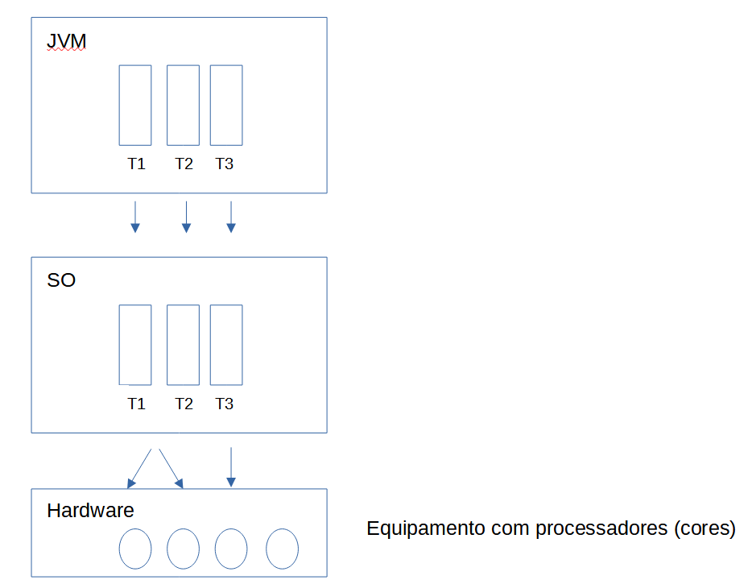

# Notas Leitura Threads

Processos (arquivos executáveis) executam concorrentemente no SO. Threads rodam concorrentemente em um mesmo processo.

Thread representa uma instância da CPU da máquina virtual java, e que tem associado um trecho de código que será executado e uma área de memória.

O uso de threads é recomendado quando executamos pelo menos duas coisas ao mesmo tempo em um programa para aproveitar as múltiplas CPU's ou para evitar que o programa inteiro fique travado ao executar uma operação demorada.

A JVM faz um mapeamento das threads java para as threads nativas do SO. A JVM funciona como uma abstração em cima do SO.

### synchronized

Usamos para sincronizar o acesso ao objeto. As threads executam o bloco synchronized bloqueando o objeto, de forma que somente 1 thread por vez acesse o objeto.
Podemos usar o synchronized tanto para um método quanto para um bloco de código dentro de um método.
Operação atômica = não pode ser interrompida pela metade.
Todo o bloco syncronized será executado de uma vez só, a thread que executa pode até ser pausada, para outra thread fazer algo, mas nenhuma outra thread pode entrar no bloco synchronized.

### volatile / AtomicXXXXX

Quando usamos a palavra reservada volatile para um atributo significa que a thread não deve cachear o atributo marcado com volatile - cada thread deve buscá-lo diretamente da memória principal.
O acesso a um atributo volatile funciona de maneira atômica, como se fosse sincronizado.

Os tipos AtomicXXXX tem a mesma finalidade, as threads usarão as variáveis sem cache. O método get() recupera o valor, e o set() atribui o valor.

Volatile e Atomic evitam o uso do synchronized.

ps: a classe ReentrantLock permite fazermos o lock explicito, mas fica a cargo do dev a liberação do lock (unlock).

Java.util.Vector = thread-safe = lista sincronizado = o código funciona corretamente mesmo com várias threads compartilhando o objeto.

### Esperando uma thread

A thread A deve esperar pela execução da thread B > a thread A invoca o método wait(), a thread B em algum ponto deve notificar que finalizou, e então invocar o método notify(). Os métodos wait e notify estão na classe Object. Se o método wait for chamado fora de um bloco synchronized uma exceção será lançada em tempo de execução.

Porque quando usamos o synchronized a JVM pega o chave (ID) do objeto e faz um lock para garantir um único acesso por thread. O wait() deixa a thread esperando e devolve a chave para a outra thread para que ela realize a sua tarefa, quando finaliza, chama o notify() que devolve a chave para a thread que estava em wait. A notificação somente pode ser feita quando estamos com a chave do objeto em mãos, isto é, dentro de um bloco synchronized.

Nota: é na classe de negócio que definimos o que será sincronizado (synchronized) bem como onde estarão as chamadas aos métodos wait() e notify().

### Método join()

O método join() deve ser chamado pela thread que será executada para informar a thread atual, que deve ela deve aguardar a finalização da execução da nova thread.
Main
t1.join();
t1.start();
t2.start();

### Threads Daemon

São como prestadores de serviço para outras threads, usadas para dar apoio a tarefas e só são necessárias rodar quando as threads normais ainda estão sendo executadas. Uma thread daemon não impede a JVM de de terminar desde que não existam mais threads principais em execução.

Podemos setar uma thread como prestadora de serviço para outras threads, usamos o método setDaemon() e configurá-lo para true antes de iniciar a thread.

### Dica

- os métodos wait/notify estão em todos os objetos (Object) e devem ser usados nos objetos que são compartilhados entre as threads (não usar como vimos na classe que implementa runnable).

### Criando Threads

Podemos criar através da classe Thread, passando uma tarefa que implementa a interface Runnable. Mas abrir, fechar threads é custoso, não há uma forma de reaproveitar as threads ? Sim ... temos a classe Executors e que possui 2 métodos:

- newFixedThreadPool (integer) - integer representa o número fixo de threads
- newCachedThreadPool() - a JVM vai administrar a criação e a destruição das threads
- Ex:
  ExecutorService pool = Executors.newFixedThreadPool(4);
  pool.execute(task);

Os métodos acima retornam um ExecutorService que possui o método execute() para chamar uma tarefa que implementa a interface Runnable e Callable (como verá mais adiante).

### Threads com Retorno

Interface Callable : permite devolver valor, e podemos definir um tempo limite de execução para a thread. Executada somente através de um pool (ExecutorService).
Para executar:

- execute (interface Runnable)
- submit (interface Callable)

Callable retorna um objeto Future e para obter o resultado basta chamar o método get().
Porém o método get() é bloqueante então caso não deseje bloquear a thread, recomenda-se que se crie outra thread para obter o resultado.
Caso o Callable não atingiu o tempo especificado e não acabou a execução, uma exception será gerada e no catch devemos chamar o método cancel() para cancelar a execução.

Nota: FutureTask > permite rodar um Callable sem um pool de thread. FutureTask recebe no construtor um Callable, e implementa a interface Runnable, assim FutureTask é iniciada com o método start(), e obtemos o resultado com o método get(). FutureTask é um intermediário entre o Runnable e o Callable.

### Fila com Threads

Uma fila é uma estrutura de dados onde o primeiro elemento que entra é o primeiro elemento que sai. Uma das implementações é o LinkedList que implementa tanto uma lista quanto uma fila.

- Ex. Queue\<Objeto> fila = new LinkedList<>();

O LinkedList possui métodos não bloqueantes para tratar os elementos:

- offer(); adiciona a fila
- size();
- poll(); reupera e remove da fila

Como alternativa, para uso em paralelo, temos o BlockingQueue (java.util.concurrent), que é uma estrutura thread-safe. Temos que definir o tamanho do array no BlockingQueue.

- Ex. BlockingQueue\<String> fila = new ArrayBlockingQueue<>(100);

Métodos bloqueantes:

- take(); recupera e remove o item da fila - quando não há mais itens na lista, bloqueia a execução aguardando novos itens (útil no lado do consumidor)
- put(); adiciona o elemento na fila - se estiver cheio aguarda até ter espaço na fila (útil no lado do produtor)

Em alguns casos precisaremos processar os comandos (as mensagens) na ordem em que chegarem no servidor. Por ex. o sinal da bolsa. Nesse caso temos que garantir a ordem dos elementos na fila com base em algum critério. Para isso podemos usar:

- BlockingQueue: PriorityBlockingQueue

Para usarmos o PriorityBlockingQueue o tipo do objeto da fila tem que implementar a interface Comparable (se não uma exceção é lançada). E não precisamos definir o tamanho de um tipo PriorityBlockingQueue, tem alocação dinâmica.

### Tratamento de Exceção na Thread

Quando ocorre uma exceção na Thread ela deve ser tratada na thread em que ocorreu, as outras threads nem ficarão sabendo do que ocorreu.

A classe Thread possui um método - setUncaughtExceptionHandler() - no qual é possível passarmos um objeto que faça o tratamento das exceções da thread. Esse objeto deve implementar a interface UncaughtExceptionHandler.

Mas e quando tivermos um pool ? não temos a instância da thread para configurar !!
Mas o Executor tem um construtor para o pool de threads que aceita que passemos um FactoryThread, por meio dele customizamos a thread que será criada pelo pool.

### Ferramentas (pasta bin do jdk)

- jconsole
- visualvm
